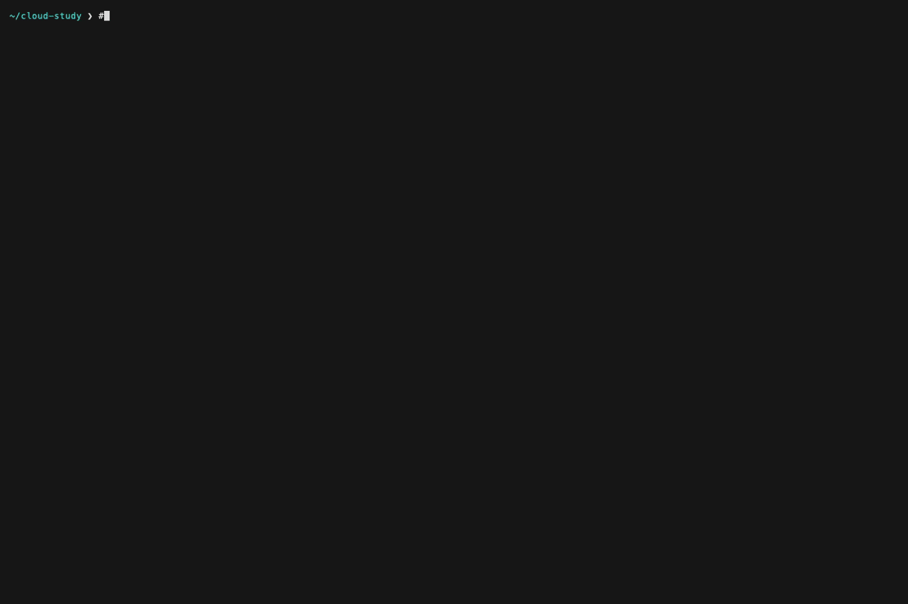
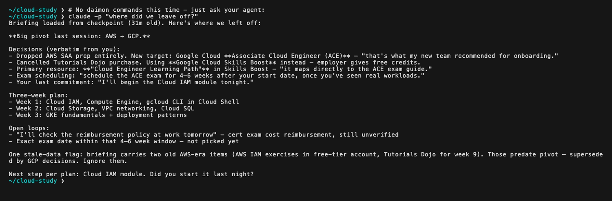

# Daimon

[](https://codecov.io/gh/Daily-Nerd/daimon)

> A **dream-briefing** for your AI agent: a skimmable "while you were away / here's where we left off" artifact, shown when you resume a session.

**Documentation: [daily-nerd.github.io/daimon](https://daily-nerd.github.io/daimon/)** — setup guides, configuration reference, concepts.

Your agent forgets everything between sessions. Daimon writes a small cognitive checkpoint when a session ends and turns it into a briefing when the next one starts — so the agent resumes from a faithful prior state instead of a confident guess:

```
While you were away — here's where we left off.

VERIFY BEFORE TRUSTING (state may have changed outside this session):
- [✓ verbatim] PR #212 state — you said you'd merge it yourself from the UI  — "I'll merge it after the demo"

Open loops:
- [✓ verbatim] Retry policy for the payments webhook — exponential or fixed?  — "don't ship the retry loop until we pick a policy"
- [~ inferred] The staging config drift needs an owner [carried]

Decisions made:
- [✓ verbatim] Postgres advisory locks over Redis locks for the scheduler  — "let's not add a Redis dependency for this"
- [~ inferred] Feature-flag the new invoice path; default off until QA signs off

Active topic: Migrating the scheduler off cron to the new worker pool
```

Every item carries its **trust class**: `✓ verbatim` items are pinned to an exact quote from the transcript and are never reworded — not by carry-over between sessions, not by rendering, not by budget truncation. `~ inferred` items are the agent's own conclusions and are allowed to evolve. Items carried from older sessions say so. That distinction — knowing which memories are quotes and which are guesses — is the point.

## See it happen

Two sessions: commit to the AWS cert, then pivot to GCP. The next briefing carries the old commitment **flagged as likely superseded** — with the confirm/reject commands inline — instead of injecting it back as current fact. One command confirms, and the stale decision is withheld from then on:



And because the briefing is injected automatically when a session starts, the agent itself answers from it — no commands, just ask:



Nothing here is mocked — the transcripts, the recording scripts, and the steps to reproduce it are in [`docs/demo/`](docs/demo/).

The name comes from the Greek *δαίμων* — a guiding spirit (distinct from "demon") believed to accompany a person, offering counsel and warnings.

---

## Install

```sh
uv tool install 'daimon-briefing[pretty]'   # pipx works identically
# upgrading: uv tool upgrade daimon-briefing
#   then `daimon hooks install <host>` to refresh installed hook scripts (non-plugin hosts)
```

Serialization needs an LLM endpoint. If the `claude` CLI is on your PATH you are **zero-config** — `daimon configure` prints `✓ ready` and you're done. Otherwise any OpenAI-compatible endpoint or headless CLI works: see [configuration](https://daily-nerd.github.io/daimon/docs/getting-started/configuration/).

**Claude Code (plugin — recommended):**

```
/plugin marketplace add Daily-Nerd/daimon
/plugin install daimon@daimon
```

**Other hosts** (Windsurf, Codex, Gemini CLI) and the agent-side skill: per-host guides at [daily-nerd.github.io/daimon/docs/hosts](https://daily-nerd.github.io/daimon/docs/hosts/).

That's it. End a session → a checkpoint is written; start the next → the briefing appears. Check state anytime with `daimon status` — it reports capture health honestly, including failures, skips, and crashes; a failed capture self-heals on the next start.

## Beyond the briefing

- **`daimon recall <terms>`** — full-text search over your whole checkpoint history (and your team's, if enabled).
- **Context switching** — `daimon projects`, `daimon brief --slug <slug>`: read another project's memory deliberately, provenance-labeled — never automatic.
- **Proactive recall** — when a new prompt overlaps prior work from an older session, the briefing surfaces it, in English or Spanish.
- **Code anchors** — `daimon anchor <file> <symbol>` pins a belief to a code symbol; drift is flagged in the next briefing. Offline, stdlib `ast`.
- **Item lifecycle** — `daimon resolve` closes loops, `daimon forget` removes an item with a tombstone event; supersession is tracked, not silently overwritten.
- **[Team memory](https://daily-nerd.github.io/daimon/docs/team/) (opt-in)** — checkpoints mirrored through a private git remote; teammates' topics and decisions appear clearly attributed, never merged into yours.
- **Signed receipts (opt-in)** — `DAIMON_RECEIPTS=1` pairs each checkpoint with an offline [vitni](https://github.com/Daily-Nerd/vitni) signature binding its exact bytes to its source transcript; verify with `daimon verify-receipt`.

## What's net-new here

- **Trust-classed, quote-pinned memory** — every briefing item is marked verbatim (exact quote, immutable everywhere) or inferred (allowed to evolve), with provenance and supersession tracked extractively. No embeddings, no graph database, no server: per-project JSON plus a derived SQLite FTS5 index, stdlib-first and offline-first.
- **The briefing UX** — memory that arrives as a session-*start* artifact you can skim in 30 seconds, ordered by what to verify first.
- **Host-agnostic hooks** — Claude Code (live-validated daily), Windsurf (live-validated), Codex (adapter shipped, awaiting first live run); other hosts are reachable via the same thin adapter shape.

## Status

| Surface | State |
|---------|-------|
| Claude Code plugin + hooks | live-validated daily |
| CLI (`brief`, `status`, `recall`, `projects`, `heal`, `anchor`, `forget`, `configure`, `hooks`, `skill`) | stable, on PyPI |
| Windsurf adapter | live-validated |
| Codex adapter | shipped, awaiting first live run |
| Gemini host hooks | blocked upstream (`gemini-cli#14715`) |
| Team memory | shipped, opt-in, early |

Daimon is self-contained at runtime — no external memory backend, no server. The full evidence trail behind every design decision lives in [research/](./research/README.md); the architecture is documented in [docs/MVP-DREAM-BRIEFING.md](./docs/MVP-DREAM-BRIEFING.md).

**License:** Apache-2.0 · **Org:** [Daily-Nerd](https://github.com/Daily-Nerd) · This repository starts at v0.2.0 (earlier development happened in a private lab repo; the research trail ships in [research/](./research/README.md)).

---

## Docs

- **[Documentation site](https://daily-nerd.github.io/daimon/)** — setup, hosts, configuration, concepts
- [MVP — Dream-Briefing](./docs/MVP-DREAM-BRIEFING.md) — authoritative architecture
- [Research Logbook](./research/README.md) — findings, decisions, evidence trail
- [Contributing](./CONTRIBUTING.md) — dev setup, tests, lint, pre-commit hooks
