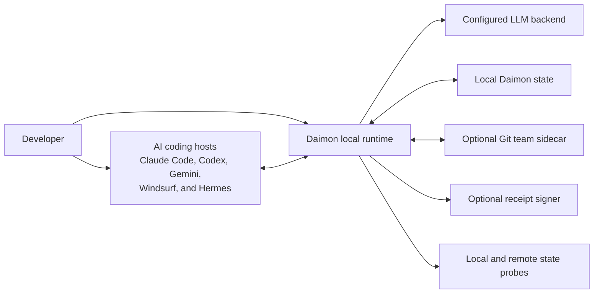
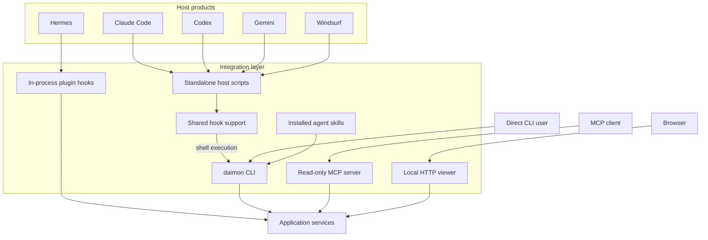
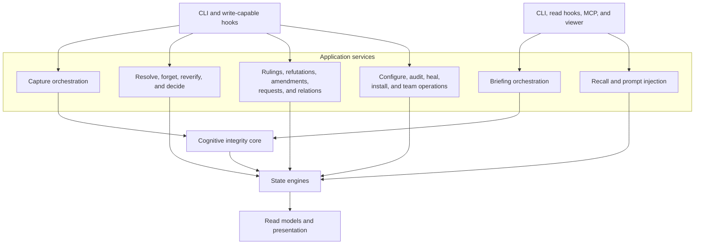
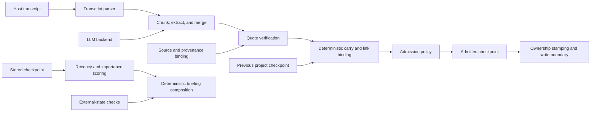
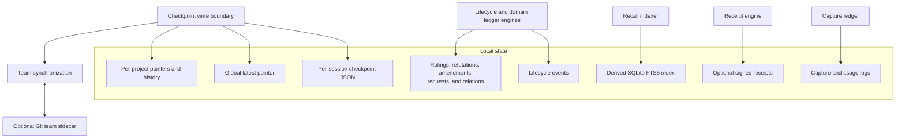
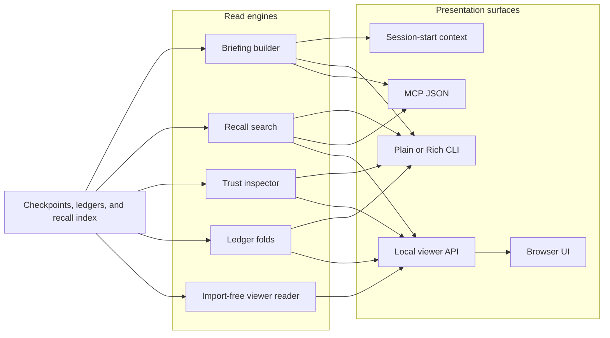
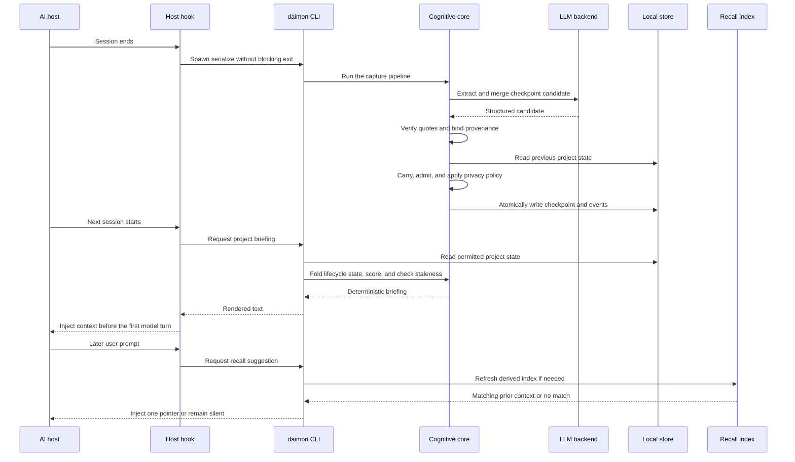

# Runtime Architecture

This is the current architecture of the shipped Daimon runtime.

Daimon is a local-first, host-agnostic modular monolith. It does not require an
always-on daemon, a remote memory service, a vector database, or a graph database.
Native host hooks and optional local surfaces enter the same Python runtime, which
stores project-scoped checkpoints and renders them back into future agent sessions.

The diagrams below describe five logical layers and two cross-cutting views. These
are responsibility boundaries, not a claim that imports follow a strict layered or
hexagonal architecture. The strongest enforced seams today are the host-to-CLI
boundary, the single capture pipeline, the checkpoint write boundary, and the
deterministic briefing renderer.

Historical designs are preserved in [Architecture Overview](./ARCHITECTURE.md) and
[MVP Dream-Briefing](./MVP-DREAM-BRIEFING.md). They explain how the current runtime
emerged, but they are not the current component map.

## 1. System context

The LLM extracts a checkpoint candidate from a transcript. Deterministic code owns
quote verification, provenance binding, admission, carry, lifecycle state, storage,
ranking, and rendering. The model proposes memory; it does not grant that memory its
trust class or final authority.

The local viewer and MCP server are optional read surfaces. They do not turn Daimon
into a required service and they are not remote memory backends.

## 2. Integration layer

Native hook scripts are standalone and standard-library-only. They cannot assume the
installed package is importable from the host interpreter, so they locate and execute
the `daimon` CLI. Host-specific payload handling stays in the adapter; serialization,
storage, and rendering stay in the runtime.

Hermes is the secondary in-process integration. The MCP surface is read-only. The
viewer binds locally and treats files as its compatibility seam.

Host capabilities are not identical. Each adapter implements only the lifecycle
events its host exposes; the host guides document where capture, start injection, or
prompt recall is unavailable.

## 3. Application layer

`capture.run` is the single write orchestration path for transcript-derived
checkpoints. Hook capture and direct CLI serialization enter that same pipeline so
they cannot silently stamp, carry, admit, or verify different checkpoint shapes.

The other application services coordinate existing engines. Command handlers own
interaction and exit behavior; domain modules own state transitions and invariants.

## 4. Cognitive integrity core

The capture direction is deliberately asymmetric:

1. The serializer extracts structured claims from the transcript.
2. Quote verification mechanically checks claimed quotations against source text.
3. Provenance binds supported items to their source.
4. Carry moves unresolved items forward using deterministic matching.
5. Admission applies redaction, deletion tombstones, identifiers, and standing-rule
   filters.
6. The write boundary stamps project and branch ownership before persistence.

The read direction scores admitted items and composes a deterministic briefing.
External-state checks can mark carried claims for renewed verification, but they do
not rewrite the remembered claim.

## 5. Persistence and trust layer

Checkpoint writes are atomic and update both the per-session record and the relevant
latest pointers. Project routing prevents one project's checkpoint from becoming
another project's carried state. The global pointer remains a compatibility and
orientation surface, not proof of project ownership.

Lifecycle and knowledge stores are append-oriented state-transition ledgers. Privacy
deletion is the deliberate exception: forgetting content may rewrite declared
surfaces and publish tombstones so erased text cannot return through re-capture or
team synchronization.

The SQLite recall database is derived state. Checkpoint JSON and ledgers are the
sources of truth; the index can be rebuilt when its source fingerprint changes.

## 6. Read and presentation layer

The CLI renderer is the source of truth for human-facing terminal output. Host start
hooks inject that rendered briefing rather than reimplementing it. MCP returns a
bounded read-only subset as JSON.

The viewer has two read paths by design. Its reader normalizes checkpoint files
without importing Daimon, which tests the file contract a separate consumer receives.
Its server delegates search, trust inspection, and ledger folds to Daimon's engines so
those semantics do not fork inside the same distribution.

## 7. End-to-end lifecycle

Host hooks are fail-open because memory support must not break the host session.
Capture work that may outlive session exit is detached where the host contract allows
it. Read paths remain project-aware: content from another project may orient the user
only through an explicitly labeled fallback and must never be persisted as this
project's own memory.

## Component map

| Logical layer | Primary responsibilities | Main implementation areas |
| --- | --- | --- |
| Integration | Host lifecycle translation, CLI entry, skills, MCP, local viewer | `hook/`, `hooks.py`, `cli/`, `mcp_server.py`, `mcp_tools.py`, `daimon_ui/` |
| Application | Capture, briefing, recall, lifecycle, knowledge, audit, and team use cases | `capture.py`, `briefing.py`, `recall.py`, `inspector.py`, `pending.py`, CLI command modules |
| Cognitive integrity | Transcript parsing, extraction, verification, provenance, carry, admission, scoring, and external checks | `transcript.py`, `serializer.py`, `provenance.py`, `carry.py`, `policy.py`, `scoring.py`, `worldcheck.py`, `schema.py`, `normalize.py` |
| Persistence and trust | Checkpoints, events, domain ledgers, receipts, declared surfaces, and team synchronization | `store.py`, `ledger.py`, `refutations.py`, `amendments.py`, `requests.py`, `relations.py`, `receipts.py`, `surfaces.py`, `teamsync.py`, `teamproject.py` |
| Read and presentation | Deterministic terminal output, read models, inspection, API responses, and browser presentation | `render.py`, `briefing.py`, `inspector.py`, `mcp_tools.py`, `daimon_ui/reader.py`, `daimon_ui/server.py`, `daimon_ui/static/` |

## Architectural invariants

- **Local state is authoritative.** No remote memory backend is required.
- **One capture pipeline owns transcript-derived writes.** Entry points may differ;
  checkpoint semantics may not.
- **Trust is deterministic after extraction.** A model cannot award its own quote
  verification or provenance.
- **Project identity is enforced at read and write boundaries.** A global pointer is
  not ownership.
- **Human decisions outrank machine suggestions.** Resolution, amendment, ruling,
  refutation, request, and relation transitions preserve that authority boundary.
- **Recall is derived.** The FTS index may be discarded and rebuilt from durable
  sources.
- **Deletion crosses every declared surface.** Forgetting is not complete while a
  plaintext copy can return through history, logs, indexes, or team state.
- **Optional surfaces stay optional.** The viewer, MCP server, team sidecar, and
  receipt signer do not become required runtime infrastructure.
